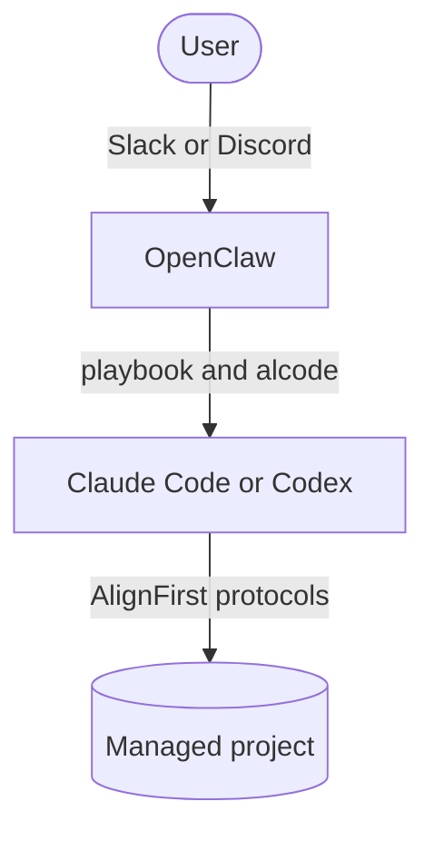

# AlignFirst Dev Kit for OpenClaw

The AlignFirst Dev Kit deploys an AI teammate for software work. It receives requests through Slack or
Discord, manages the conversation in OpenClaw, and delegates repository work to Claude Code or Codex
through `alcode` and the AlignFirst protocols.



One deployment is a **claw**: a dedicated service account running OpenClaw under its own name and
channel identity. The communication surface, delegated coding agent, and OpenClaw runtime provider are
independent choices. Each task moves from a channel into its own thread session, then into an isolated
project workspace before delegated changes begin.

## Create a Claw

Install the setup skill in the repository where your agent will assemble the private administration
repository:

```sh
npx -y skills add https://github.com/paleo/alignfirst --skill alignfirst-setup-guide
```

Ask the agent to create a claw. The setup skill collects deployment values, renders
one Slack or Discord overlay and one Claude Code or Codex overlay, and produces role-specific
installation, security, operation, and recovery runbooks.

Managed projects receive the full preparation contract: the AlignFirst bootstrap line, an optional work-files repository,
docmap, isolated workspaces, and a project-specific `DEVELOPERS.md`.

## Maintain the Product

Read the
[maintainer architecture](docs/alignfirst-dev-kit/alignfirst-dev-kit.md) before changing the
OpenClaw workspace, playbook, or regression harness. The
[regression-test guide](alignfirst-dev-kit-tests/README.md) covers the synthetic Slack and Discord
suite.
