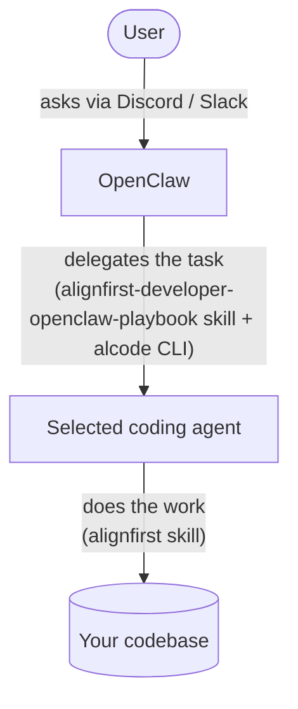

# AlignFirst Developer

AlignFirst Developer is an AI teammate for software work. This guide deploys it on the [OpenClaw](https://openclaw.ai/) runtime for two use cases:

1. **For developers** — a programming partner instead of a programming tool.
2. **For non-developers** — a teammate who handles simple coding tasks.

## Architecture

Install OpenClaw on a VPS.



OpenClaw runs the conversation and hands coding tasks to Claude Code or Codex through the **`alignfirst-developer-openclaw-playbook`** skill and the **`alcode`** CLI. The selected coding agent follows the **`alignfirst`** spec/plan/execution workflow and returns the result for the AlignFirst Developer to relay.

### Supported OpenClaw channels

The playbook is designed for **Slack** and **Discord**.

## Configuring the VPS

### Your projects

Install the project registry CLI globally:

```bash
npm i -g @paleo/alproject@latest
```

Create `~/.alproject.json` for the OpenClaw service account. `root` stores the registry and resolves relative command paths. `projectParents` lists every directory whose direct child repositories the bot may use.

```json
{
  "root": "~/projects",
  "projectParents": ["~/projects", "~/work/projects"],
  "firstPort": 6500,
  "lastPort": 7700
}
```

Create the configured directories, then register each existing Git main worktree:

```bash
alproject register /absolute/path/to/project
alproject list
```

Add both port options when the project needs isolated workspace ports. Run `alproject --guide` for configuration, registration, allocation, and recovery procedures. An optional `<root>/alproject-guide.md` can append host-specific project-creation rules to that guide.

If your bot needs access to a git platform (GitHub, GitLab), set it up.

### alcode

An AlignFirst Developer needs a coding agent. The [`alcode`](packages/alcode/README.md) CLI is a coding agent wrapper. Install it globally:

```bash
npm i -g @paleo/alcode@latest
```

Select the coding agent explicitly:

```bash
export ALIGNFIRST_CODE_AGENT=codex # or claude
```

Install and authenticate the selected CLI. Run `claude`, then `/login`, for Claude Code. Run `codex login` for Codex. The selected command must work for the OpenClaw service account.

Normal runs use Claude's `--permission-mode auto` or Codex's `--sandbox workspace-write`. `ALIGNFIRST_CODE_SKIP_PERMISSIONS=1` selects Claude's `--dangerously-skip-permissions` or Codex's `--dangerously-bypass-approvals-and-sandbox`.

Claude models default to `fable,opus,sonnet,haiku`. Codex models default to the stable alcode aliases `sol,terra,luna`, resolved against the installed CLI's bundled catalog. `ALIGNFIRST_CODE_MODELS` replaces the selected list and can pin an explicit Codex slug. `ALIGNFIRST_CODE_UNSET` strips additional variables from the coding-agent child.

Sessions record their coding agent. Resume requires the same selector; legacy agentless sessions require a new run.

Install the `alignfirst` skill for the selected coding agent:

```bash
npx skills add https://github.com/paleo/alignfirst --global --yes --agent claude-code --skill alignfirst
npx skills add https://github.com/paleo/alignfirst --global --yes --agent codex --skill alignfirst
```

Skill:

- **`alignfirst`** — spec/plan/code workflow for coding tasks.

### Skills for OpenClaw

OpenClaw will need these skills: `alignfirst-developer-openclaw-playbook`, `alignfirst`:

```bash
npx skills add https://github.com/paleo/alignfirst --global --yes --agent universal \
  --skill alignfirst-developer-openclaw-playbook --skill alignfirst
```

Skills:

- **`alignfirst-developer-openclaw-playbook`** — operating instructions for an AlignFirst Developer running on OpenClaw.
- **`alignfirst`** — not strictly needed, but it helps the bot understand its coding tool.

### `openclaw.json`

OpenClaw needs a coding tool profile that can still post to chat, and the two skills wired in:

```jsonc
{
  "tools": {
    "profile": "coding",
    "alsoAllow": ["message"] // let the channel session open threads and post
  },
  "agents": {
    "defaults": {
      "skills": ["alignfirst", "alignfirst-developer-openclaw-playbook"],
      "heartbeat": {
        // Stock heartbeat prompt with a NO_REPLY tail instead of HEARTBEAT_OK: with block
        // streaming on, OpenClaw (2026.6.11) holds back only NO_REPLY from the stream —
        // a HEARTBEAT_OK ack posts to the channel root as literal text before the
        // heartbeat filter can strip it. Copy it from alignfirst-developer-tests/openclaw.json.
        "prompt": "Read HEARTBEAT.md if it exists (workspace context). Follow it strictly. Do not infer or repeat old tasks from prior chats. If nothing needs attention, reply exactly NO_REPLY."
      }
    }
  },
  "channels": {
    "slack": {
      "replyToMode": "all",
      "thread": { "initialHistoryLimit": 100 }
    },
    "discord": {
      // Leave `autoThread` off for Discord
    }
  }
}
```

The playbook expects each task to run in its **own thread session**. With Slack, `replyToMode: "all"` answers every user message in a new thread. On Discord the agent opens the thread itself, so `autoThread` stays off; `alsoAllow: ["message"]` is what lets it do so.

### `workspace/AGENTS.md`

Here is an example of a [workspace's `AGENTS.md`](alignfirst-developer-tests/workspace/AGENTS.md). The only required part is the first section.

Feel free to adapt the other sections. In particular, replace the instructions related to tickets with your own instructions on how to access your Linear, Jira, or GitHub/GitLab issues.

## Preparing a project

Before handing a project to an AlignFirst Developer, set it up for autonomous work:

- **Install [`@paleo/workspace`](https://www.npmjs.com/package/@paleo/workspace)** so the agent runs each task in its own isolated git-worktree environment, several branches in parallel. See its [README](packages/workspace/README.md) for setup.
- **Add a `DEVELOPMENT.md`** at the project root: stack, layout, daily commands, conventions (ticket / branch / commit), and how to find docs. Example: [`projects-fixture/template/DEVELOPMENT.md`](alignfirst-developer-tests/projects-fixture/template/DEVELOPMENT.md).
- **Register the main worktree with `alproject`** after its `.git` directory exists. Use both port-allocation options when its workspace setup requires them.

## Contribute

The `alignfirst-developer-openclaw-playbook` skill is developed against an internal regression-test harness: [`alignfirst-developer-tests/README.md`](alignfirst-developer-tests/README.md).

Get started:

```bash
# From the repository root
git clone --depth 1 https://github.com/openclaw/openclaw.git .local/openclaw

cd alignfirst-developer-tests

cp .env.local.example .env.local
# Set the API keys and ALIGNFIRST_CODE_AGENT in `.env.local`

npm install && npm run env:build

# Run scenarios, e.g. all of them on every channel:
npm run e2e -- --channel all --all
```
