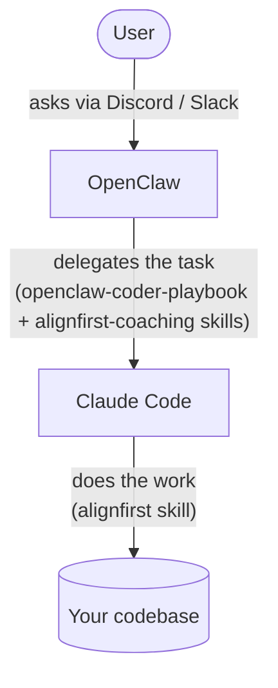

# OpenClaw Coder (experimental)

Turn an [OpenClaw](https://openclaw.ai/) agent into an autonomous AI programmer. Two use cases:

1. **For developers** — a programming partner instead of a programming tool.
2. **For non-developers** — a teammate who handles simple coding tasks.

## Architecture

Install OpenClaw on a VPS.



OpenClaw runs the conversation and, when there's code to write, hands the task to Claude Code through the **`openclaw-coder-playbook`** and **`alignfirst-coaching`** skills. Claude Code does the actual work with the **`alignfirst`** skill, then returns the result for OpenClaw to relay back to the user.

### Supported OpenClaw channels

The playbook is designed for **Slack** and **Discord**.

## Configuring the VPS

### Your projects

Put your git repositories in `~/projects/`.

If your bot needs access to a git platform (GitHub, GitLab), set it up.

### Claude Code

Your AI developer is a modern developer. It needs the real Claude Code CLI.

- Install the [Claude Code CLI](https://claude.com/product/claude-code) and authenticate it with your account. The `claude` command must work in the terminal.
- Install the `alignfirst` skill:

```bash
npx skills add https://github.com/paleo/alignfirst --global --yes --agent claude-code --skill alignfirst
```

Skill:

- **`alignfirst`** — spec/plan/code workflow for coding tasks.

### Skills for OpenClaw

OpenClaw will need these skills: `openclaw-coder-playbook`, `alignfirst-coaching`, `alignfirst`:

```bash
npx skills add https://github.com/paleo/alignfirst --global --yes --agent universal \
  --skill openclaw-coder-playbook --skill alignfirst-coaching --skill alignfirst
```

Skills:

- **`openclaw-coder-playbook`** — operating instructions for an OpenClaw AI coder.
- **`alignfirst-coaching`** — teaches the agent to delegate coding tasks to Claude Code.
- **`alignfirst`** — not strictly needed, but it helps the bot understand its coding tool.

The `alignfirst-coaching` skill drives the [`alcoach`](../packages/alcoach/README.md) CLI, which coaches Claude Code through a protocol and streams a live transcript to a log file under `.plans/`.

Optional `alcoach` environment variables:

```bash
export ALIGNFIRST_COACH_SKIP_PERMISSIONS=1        # Use --dangerously-skip-permissions instead of --permission-mode auto
export ALIGNFIRST_COACH_UNSET=ANTHROPIC_API_KEY   # Unset listed vars (comma-separated) before calling claude, e.g. to force an SSO/plan account
```

#### Background runs and the completion callback

Coaching runs are long, so `alcoach` does not block OpenClaw. When a callback URL is configured, a run executes as a detached background task: `alcoach` returns immediately, streams its transcript to the log, and on completion calls OpenClaw back **in the originating thread** so it resumes the workflow and posts the outcome to the user. The agent goes available and waits for that callback — it does **not** poll.

Set these on the gateway so the callback resolves:

```bash
export ALIGNFIRST_COACH_CALLBACK_URL=http://127.0.0.1:<gateway-port>/hooks/agent  # its presence selects background mode
export ALIGNFIRST_COACH_CALLBACK_TOKEN=<bearer-token>                             # must match hooks.token in openclaw.json
```

The per-thread session key is not an env var: the agent reads it from the `session_status` tool and passes it as `--session-key`. If a callback URL is configured but `--session-key` is missing, `alcoach` exits non-zero rather than degrading silently. Without a callback URL, `alcoach` runs in the foreground (for a human or another agent) and blocks until the run finishes.

### `openclaw.json`

OpenClaw needs a coding tool profile that can still post to chat, and the three skills wired in:

```jsonc
{
  "tools": {
    "profile": "coding",
    "alsoAllow": ["message"] // let the channel session open threads and post
  },
  "agents": {
    "defaults": {
      "skills": ["alignfirst", "alignfirst-coaching", "openclaw-coder-playbook"]
    }
  },
  "channels": {
    "slack": {
      "replyToMode": "all",
      "thread": { "initialHistoryLimit": 100 }
    },
    "discord": {
      // Leave `autoThread` off for Discord
    }
  }
}
```

The playbook expects each task to run in its **own thread session**. With Slack, `replyToMode: "all"` answers every user message in a new thread. On Discord the agent opens the thread itself, so `autoThread` stays off; `alsoAllow: ["message"]` is what lets it do so.

### `workspace/AGENTS.md`

Here is an example of a [workspace's `AGENTS.md`](playbook-test/workspace/AGENTS.md). The only required part is the first section.

Feel free to adapt the other sections. In particular, replace the instructions related to tickets with your own instructions on how to access your Linear, Jira, or GitHub/GitLab issues.

## Preparing a project

Before handing a project to OpenClaw, set it up for autonomous work:

- **Install [`@paleo/workspace`](https://www.npmjs.com/package/@paleo/workspace)** so the agent runs each task in its own isolated git-worktree environment, several branches in parallel. See its [README](../packages/workspace/README.md) for setup.
- **Add a `DEVELOPMENT.md`** at the project root: stack, layout, daily commands, conventions (ticket / branch / commit), and how to find docs. Example: [`projects-fixture/template/DEVELOPMENT.md`](playbook-test/projects-fixture/template/DEVELOPMENT.md).

## Contribute

The `openclaw-coder-playbook` skill is developed against an internal regression-test harness: [`playbook-test/README.md`](playbook-test/README.md). Maintainer overview: [`docs/openclaw-coder.md`](../docs/openclaw-coder.md).

Get started:

```bash
# From this `openclaw-coder/` directory
git clone --depth 1 https://github.com/openclaw/openclaw.git .local/openclaw

cd playbook-test

cp .env.local.example .env.local
# Set the API keys in `.env.local` as needed

npm install && npm run env:build

# Run scenarios, e.g. all of them on every channel:
npm run e2e -- --channel all --all
```