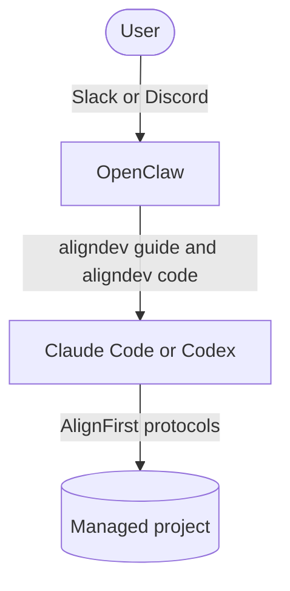

# aligndev

Autonomous software development. You say what you want; the assistant drives the coding agents and brings you the decisions.

You talk to an **assistant**, the way you would to a developer on your team. It never touches the code itself. It isolates each task in its own workspace, then hands the investigation and the coding to an AI coding agent, **the agent**, which follows the [AlignFirst](https://alignfirst.paroi.tech/) protocols: specify, plan, implement, review. The assistant reads the agent's work, tests it, asks you what only you can decide, and opens the pull request.

`aligndev` is the assistant's CLI. It gives the assistant its playbook, launches and tracks the agent, and keeps the inventory of your projects. You never run it yourself: the assistant does.

## The Assistant's Workflow

For each task, the assistant:

1. Discusses the task with the agent and has it write a **spec**.
2. Has it write the **plans**.
3. Has the plans **executed** in a fresh session.
4. Has a **code review** done in another session.
5. Has the review findings **fixed** in yet another session.
6. For UI changes, **tests manually** and checks the dev-server logs.
7. Has fixes made as needed.
8. Takes **screenshots** for good measure.
9. Has the agent **open a draft PR**.

A task can also start at any intermediate step.

## Two Ways to Run the Assistant

**In your coding agent.** A Claude Code or Codex session becomes the assistant of the repository it starts in. You keep chatting in the same session; the agents it launches work in the background.

**As an OpenClaw bot.** [AlignDev for OpenClaw](#start-as-an-openclaw-bot) deploys the assistant on a server, under its own name in Slack or Discord. It works on every project of the host, one thread per task.

Either way, the agent is Claude Code or Codex. A coding-agent assistant launches its own kind by default.

## Start in Claude Code or Codex

The project needs an AlignFirst `.plans` directory, in its repository or in a [companion directory](https://github.com/paleo/alignfirst/tree/main/packages/alignfirst#companion-directories). The [setup guide](https://github.com/paleo/alignfirst/blob/main/skills/alignfirst-setup-guide/references/coding-agent-assistant.md) prepares it.

The agent needs network access and writes outside the repository, so the assistant launches it outside its sandbox: approve that request when it comes.

### With the Skill

Install the `aligndev` skill:

```sh
npx skills add https://github.com/paleo/alignfirst --global --skill aligndev
```

Then start a session in the project and invoke `/aligndev` in Claude Code, or `$aligndev` in Codex.

### Without a Skill

Add this section to your global agent instructions (`~/.claude/CLAUDE.md`, `~/.codex/AGENTS.md`, or the equivalent):

```markdown
## AlignDev

When the user mentions **aligndev**, follow the `aligndev` playbook if it is already in context. Otherwise, run `npx -y aligndev guide` and follow it.
```

Then ask your session to work with aligndev.

### Requirements

- Node.js 22.11 or later. The assistant runs `aligndev` through `npx`, so there is nothing to install.
- Claude Code or Codex installed and logged in: `claude` then `/login`, or `codex login`.
- Linux or macOS, or Windows through WSL.

## Configuration

`~/.alignfirst/aligndev.config.json` is optional. Without it, every key takes its default. For example, to launch Codex as the agent, whatever runs the assistant:

```json
{
  "code": { "agent": "codex" }
}
```

- `platform` — `codingAgent` (default) for a coding-agent assistant, `openclaw` for an OpenClaw bot.
- `projectsRoot` — the projects directory of an OpenClaw host. Required by `openclaw`. `~/` expands to the home directory; a relative path resolves against `~/.alignfirst/`.
- `code.agent` — the agent: `claude` or `codex`. Default: the coding agent that runs the assistant, detected from its environment. Set it to launch the other one, or when both are detected, as with Codex in a VS Code terminal where the Claude Code extension is installed.
- `code.models` — the models the assistant may choose from. Default: Claude's `fable`, `opus`, `sonnet`, `haiku`, or Codex's `astra`, `sol`, `terra`, `luna`.
- `code.skipPermissions` — `true` runs Claude Code with `--dangerously-skip-permissions` instead of `--permission-mode auto`, and Codex with `--dangerously-bypass-approvals-and-sandbox` instead of `--sandbox workspace-write`. Default: `false`.
- `code.unset` — environment variables to hide from the agent, such as an API key meant for another tool on the host.

Unknown keys and invalid values are errors.

## Start as an OpenClaw Bot

AlignDev for OpenClaw runs the assistant as an OpenClaw bot. One deployment is a dedicated service account running the assistant under its own name and channel identity. The communication surface, the agent and the assistant's model provider are independent choices. Each task moves from a channel into its own thread, then into an isolated project workspace. See the [product page](https://alignfirst.paroi.tech/openclaw-dev-kit) for an overview.



Install the setup skill where your agent will assemble the deployment's private administration repository:

```sh
npx -y skills add https://github.com/paleo/alignfirst --global --skill alignfirst-setup-guide
```

Then ask the agent to create an assistant. The skill collects the deployment values, renders one Slack or Discord variant and one Claude Code or Codex variant, and writes the installation, security, operation and recovery runbooks. Each managed project receives the full preparation contract: the AlignFirst bootstrap line, an optional work-files repository, docmap, isolated workspaces and a project-specific `DEVELOPERS.md`.

## Under the Hood

`aligndev` documents itself for the assistant: `aligndev --help`, then `aligndev guide`, print everything it needs. Maintainers: see [aligndev Architecture](https://github.com/paleo/alignfirst/blob/main/docs/aligndev-architecture.md) and the [AlignDev for OpenClaw map](https://github.com/paleo/alignfirst/blob/main/docs/aligndev-openclaw/aligndev-openclaw.md).
